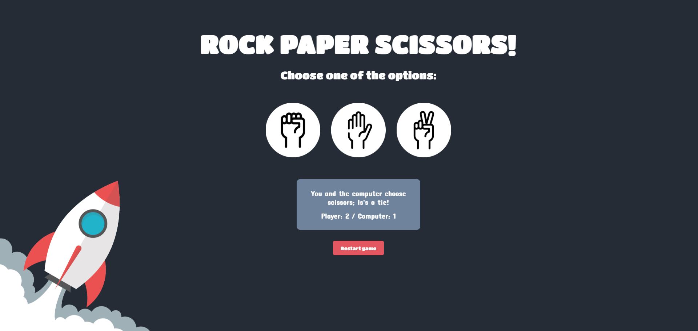

# React App: Rock, paper, scissors game.

## Description:

Welcome aboard! The onboard computer has prepared a little game for us to have fun during the trip: let's play Rock-Paper-Scissors! 

Both you and the computer will choose one of the options, and the result of the round will appear in the screen. Don't worry, the total score will appear too! The first one to win 5 rounds wins the game.

## Let's play:

If you want to play with us from your browser, go to https://vgardella.github.io/rock-paper-scissors-react/.

## How to play:



In front of you are three big buttons: the first one represents 'rock' (left), the next represents 'paper' (center) and the last one represents 'scissors' (right). Click on a button to make your choice, then the computer will choose an option as well. In the screen will appear both choices, the result of the round, and the points of each player. The player that gets 5 points first wins.

If you want to restart the game, press the 'Restart game' button below the results screen.

# Project: React app.

## Structure:

For this project, a simple folder structure was chosen given the small number of components and straightforward logic of the game.

### Folder hierarchy:

```
src/: root files
    assets/: reusable components
    components/: images, fonts and style files
    utils/: helper modules
public/: static files
tests/: test files
```

## Testing:

The 'Vitest' framework was used to run tests on the components and the game.